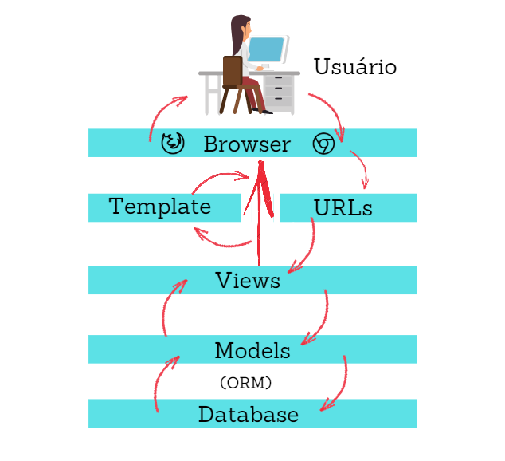

 * [Voltar](README.md)
 

 
# Entendendo o MTV do Django

Agora que já sabemos como criar um projeto e como criar uma app com o Django, já estamos prontos para criar nossa primeira aplicação com o framework. Porém, antes disso, precisamos entender como funciona a arquitetura do framework, o que veremos neste artigo.

# Arquitetura do Django

A arquitetura do Django é relativamente simples. Basicamente, um projeto Django possui como padrão de projeto o MTV (Model, Template, View), que servem para:

* Model: Mapeamento do banco de dados para o projeto;
* Template: Páginas para visualização de dados. Normalmente, é aqui que fica o HTML que será renderizado nos navegadores;
* View: Lógica de negócio. É aqui que determinamos o que irá acontecer em nosso projeto.

Toda esta arquitetura é interligada e conversam entre si. Uma depende da outra para realizar um determinado serviço e, no final, executar a tarefa que o usuário solicitou. A imagem abaixo descreve exatamente como este processo funciona:

Como visto na imagem, quando o usuário faz uma requisição pelo browser, utilizando uma rota, é executado um método das Views, que utiliza os Models para acessar o banco de dados e retornar as informações. Estas informações são renderizadas pela camada de Template e, finalmente, é renderizado para o usuário pelo navegador.

Toda esta arquitetura se assemelha bastante com o padrão MVC (Model, View, Controller), utilizado em diversos outros frameworks, como o Laravel, Zend Framework e muitos outros. Comparado ao MVC, as camadas do padrão MTV podem ser consideradas como podemos ver abaixo:

* M (MTV) = M (MVC): Estas duas camadas possuem a mesma responsabilidade, mapeamento do banco de dados para o projeto;
* T (MTV) = V (MVC): Estas camadas possuem a mesma responsabilidade, exibir informações para o usuário da aplicação, normalmente utilizando páginas HTML;
* V (MTV) = C (MVC): Estas duas camadas, apesar de possuírem responsabilidades parecidas, conceitualmente, apresentam algumas diferenças.

No próprio FAQ do Django, há uma área onde os desenvolvedores explicam as diferenças conceituais e o motivo de nomear a camada de visualização de dados como templates e de views a camada de lógica de acesso.

***
Well, the standard names are debatable. In our interpretation of MVC, the “view” describes the data that gets presented to the user. It’s not necessarily how the data looks, but which data is presented. The view describes which data you see, not how you see it. It’s a subtle distinction. So, in our case, a “view” is the Python callback function for a particular URL, because that callback function describes which data is presented. Furthermore, it’s sensible to separate content from presentation – which is where templates come in. In Django, a “view” describes which data is presented, but a view normally delegates to a template, which describes how the data is presented. Where does the “controller” fit in, then? In Django’s case, it’s probably the framework itself: the machinery that sends a request to the appropriate view, according to the Django URL configuration. If you’re hungry for acronyms, you might say that Django is a “MTV” framework – that is, “model”, “template”, and “view.” That breakdown makes much more sense. At the end of the day, of course, it comes down to getting stuff done. And, regardless of how things are named, Django gets stuff done in a way that’s most logical to us.
***

Resumidamente, a equipe de desenvolvimento do framework entende que a camada view descreve quais dados serão apresentados ao usuário, não a forma (aparência) que eles serão exibidos. Portanto, no padrão MTV, uma view é uma função que retorna algo para uma solicitação, porque ela define apenas quais dados serão apresentados, não como serão mostrados.

Além disso, é sensato separar o conteúdo da apresentação (por questões de organização e padronização do código). É aí que entra camada template. Com os dados retornados pela view, a template fica responsável por definir a forma que esses dados serão apresentados, normalmente em páginas HTML.

Porém, onde o controller se encaixa? No Django, os desenvolvedores do framework entendem que esta camada é a própria estrutura do projeto. É este mecanismo que envia uma solicitação para a view adequada de acordo com a configuração de rotas do Django. E isso faz sentido! Se pararmos para pensar, o controlador da aplicação é o próprio conjunto de bibliotecas que compõe o projeto. A view é mais adequada a retornar os dados a serem visualizados, que serão exibidos ao usuário por meio de templates.

Agora que a arquitetura do Django ficou clara (espero :p), nós já estamos aptos a iniciar o desenvolvimento da nossa primeiro aplicação e, finalmente, programar utilizando este incrível framework. E é exatamente isso que veremos no próximo artigo. Até lá!