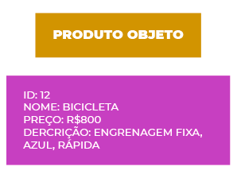

# O que é ORM?

Object-Relational Mapping (ORM), em português, mapeamento objeto-relacional, é uma técnica para aproximar o paradigma de desenvolvimento de aplicações orientadas a objetos ao paradigma do banco de dados relacional. O uso da técnica de mapeamento objeto-relacional é realizado através de um mapeador objeto-relacional que geralmente é a biblioteca ou framework que ajuda no mapeamento e uso do banco de dados.

# Problema da impedância de dados

Quando estamos trabalhando com aplicações orientadas a objetos que utilizam banco de dados relacionais para armazenamento de informações, temos um problema chamado impedância objeto-relacional devido às diferenças entre os 2 paradigmas.

O banco de dados relacional trabalha com tabelas e relações entre elas para representar modelos da vida real. Dentro das tabelas temos várias colunas e a unidade que temos para representação no modelo relacional é uma linha:
	

O paradigma orientado a objetos possui um modo um pouco diferente de trabalhar. Nele nós temos diversos elementos como classes, propriedades, visibilidade, herança e interfaces. A unidade quando falamos de orientação a objetos é o objeto que representa algo do mundo real, seja abstrato ou concreto:





As principais dificuldades que essas diferenças entre paradigmas causa:

* Representação dos dados e do modelo, já que as estruturas são distintas;
* Mapeamento entre os tipos de dados da linguagem de programação e do banco de dados;
* Modelo de integridade relacional do banco relacional;

# O ORM

Pensando nos problemas descritos acima, o ORM define uma técnica para realizar a conciliação entre os 2 modelos. Uma das partes centrais é através do mapeamento de linhas para objetos:


As bibliotecas ou frameworks ORM definem o modo como os dados serão mapeados entre os ambientes, como serão acessados e gravados. Isso diminui o tempo de desenvolvimento, uma vez que não é necessário desenvolver toda essa parte. Outra vantagem está na adaptação de novos membros na equipe, como muitos projetos comerciais utilizam a mesma ferramenta, é possível encontrar membros que já estão acostumados com o padrão de trabalho.

# Padrões utilizados no mercado
Independente da linguagem de programação que o ORM é implementado, geralmente ele segue um padrão bem definido. No mercado existem dois padrões que são amplamente utilizados, o Data Mapper e o Active Record. Ambos os padrões foram definidos por Martin Fowler em seu livro Padrões de Arquitetura de Aplicações Corporativas.

# Data Mapper
Nesse padrão a classe que representa a tabela do banco de dados não deve conhecer os recursos necessário para realizar as transações com banco de dados: inserir, atualizar e apagar informações. Esses recursos ficam em uma classe própria do ORM, garantindo que as classes que representam a tabela tenha uma única responsabilidade:


> (Imagem do livro “Padrões de Arquitetura de Aplicações Corporativas”)

Na prática, para a maioria dos ORMs do mercado que implementam o padrão Data Mapper, independente da linguagem, vamos ter um código muito parecido com abaixo:


```
EntityManager entityManager = Persistence.createEntityManagerFactory("persistente-unit");

entityManager.getTransaction().begin();

Pessoa pessoa = new Pessoa();
pessoa.setId(1);
pessoa.setSobrenome("Silva");
pessoa.setPrenome("João");
pessoa.setNumeroDeDependentes(2);

entityManager.persist(pessoa);
entityManager.getTransaction().commit();
 
```

# Active Record

Nesse padrão, diferentemente do anterior, a classe que representa a tabela conhece os recursos necessários para realizar as transações no banco de dados, geralmente ela herda uma classe com todos esses comportamentos. Veja abaixo um diagrama retirado do livro “Padrões de Arquitetura de Aplicações Corporativa”:


Na maioria dos ORM que implementam o padrão Active Record teremos um código muito parecido com esse:

```
pessoa = pessoa.new
pessoa.sobrenome = "Silva"
pessoa.prenome = "João"
pessoa.numeroDeDependentes = 2

pessoa.save()

```
O código é válido para o ORM do Ruby On Rails.


# Principais ORMs do mercado
## Java

* Hibernate
* EclipseLink
* ActiveJPA 
## Kotlin
* Exposed
## C#

* Entity Framework
* Nhibernate
* Dapper 

## Node
* Sequelize

## PHP

* Doctrine
* Eloquent

## Ruby

* Ruby On Rails ActiveRecord
* Datamapper

## Python

* DjangoORM
* SqlAlchemy


# Considerações finais
Existem muitas discussões entre usar um ORM que implementa Data Mapper ou Active Record. Muitos desenvolvedores defendem um ou outro com unhas e dentes, porém, na realidade, como quase tudo na nossa área, não existe bala de prata. Se tiver a oportunidade aconselho estudar ORMs da sua linguagem que trabalha em ambos os padrões, assim você terá um conhecimento maior para escolher entre um ou outro dependendo dos requisitos do seu projeto.