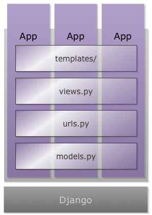

# Projeto vs App

**No Django, um projeto é composto por uma ou várias apps. Cada app possui sua arquitetura e arquivos de models, views e templates. Sendo assim, as apps podem representar aplicações isoladas, porém em um mesmo projeto.**

**Imagine que estamos criando uma aplicação para um blog. Normalmente, um blog possui uma aplicação de administração (para cadastro dos posts) e uma página web (para leitura dos posts). Estas duas aplicações podem estar em um mesmo projeto, porém de forma isoladas.**

**Na imagem abaixo podemos ver a arquitetura básica de várias apps em um mesmo projeto:**

